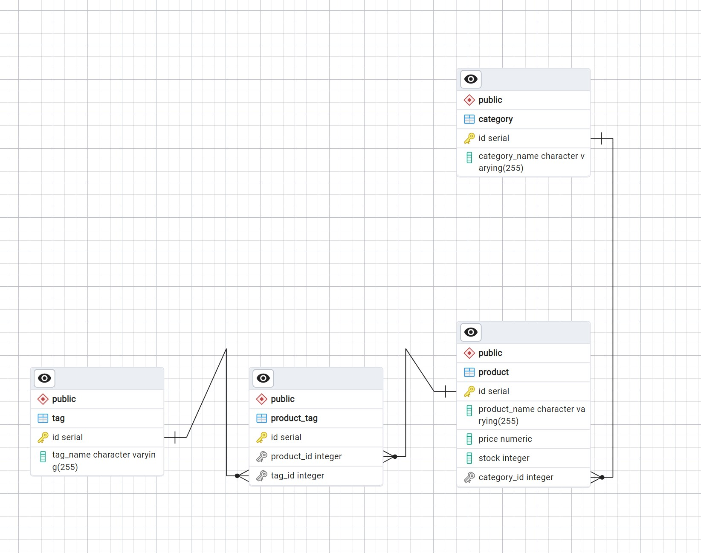

# retail-ecommerce

## Description

- Internet retail, also known as **e-commerce**,is a process of selling goods or services online. This empowers an organization to sell its products and services via a website on the internet.
- Almost anything can be purchased through e-commerce today, which makes e-commerce highly competitive.Due to the prevalence of these platforms, developers should understand the fundamental architecture of e-commerce sites.
- This project is to develop the back end for an e-commerce site. 
- This allows user to preform CRUD operations on various entities of the ecommerce website, like products, tags, categories.
- During this implementation, I was able to configure a working Express.js API to use Sequelize to interact with a PostgreSQL databas and thus apply my knowledge on Node.js, Express.js Sequelize, and PostgreSQL.

## Table of Contents 

- [Installation](#installation)
- [User Story](#user-story)
- [Usage](#usage)
- [Usage & Tests](#usageandtest-screenshots)
- [Acceptance Criteria](#acceptance-criteria)
- [DBSchema](#dbschema)
- [Credits](#credits)
- [License](#license)

## Installation

Follow these instructions to create your project and deploy it to GitHub Pages:

1. Create a new repository on your GitHub account and clone it to your computer.

2. When you're ready to deploy, use the git add, git commit, and git push commands to save and push your code to your GitHub repository.

3. Navigate to your GitHub repository in the browser and then select the Settings tab on the right side of the page.

4. On the Settings page, select Pages on the left side of the page. On the GitHub Pages screen, choose main in the dropdown under Branch. Click the Save button.

5. Navigate to <your-github-username.github.io/your-repository-name> and you will find that your new webpage has gone live! For example, if your GitHub username is "lernantino" and the project is "css-demo-site", then your URL would be <lernantino.github.io/css-demo-site>.

6. To ensure that the node_modules folder is not pushed in the GITHUB, the .gitignore has to be updated and included.

7. All the environment variables are added in the .env to ensure that the User credentials are confidential. A sample .env.EXAMPLE has been provided in the repository and the .env is added in the .gitignore.

## User-Story 
```
AS A manager at an internet retail company
I WANT a back end for my e-commerce website that uses the latest technologies
SO THAT my company can compete with other e-commerce companies
```

## Usage

**Link for the repository :** 

https://github.com/shwetakadam5/retail-ecommerce

**Link for the functionality demo :**
Quick Demo (Important):


## UsageAndTest Screenshots :

#### 1. ****Retail E-commerce : ERD****

 

#### 2. ****Retail E-commerce : :****

 


## Acceptance-Criteria

```
GIVEN a functional Express.js API
WHEN I add my database name, PostgreSQL username, and PostgreSQL password to an environment variable file
THEN I am able to connect to a database using Sequelize
WHEN I enter schema and seed commands
THEN a development database is created and is seeded with test data
WHEN I enter the command to invoke the application
THEN my server is started and the Sequelize models are synced to the PostgreSQL database
WHEN I open API GET routes in Insomnia for categories, products, or tags
THEN the data for each of these routes is displayed in a formatted JSON
WHEN I test API POST, PUT, and DELETE routes in Insomnia
THEN I am able to successfully create, update, and delete data in my database
```
## DBSchema

```md


* `Category`

  * `id`

    * Integer.
  
    * Doesn't allow null values.
  
    * Set as primary key.
  
    * Uses auto increment.

  * `category_name`
  
    * String.
  
    * Doesn't allow null values.

* `Product`

  * `id`
  
    * Integer.
  
    * Doesn't allow null values.
  
    * Set as primary key.
  
    * Uses auto increment.

  * `product_name`
  
    * String.
  
    * Doesn't allow null values.

  * `price`
  
    * Decimal.
  
    * Doesn't allow null values.
  
    * Validates that the value is a decimal.

  * `stock`
  
    * Integer.
  
    * Doesn't allow null values.
  
    * Set a default value of `10`.
  
    * Validates that the value is numeric.

  * `category_id`
  
    * Integer.
  
    * References the `Category` model's `id`.

* `Tag`

  * `id`
  
    * Integer.
  
    * Doesn't allow null values.
  
    * Set as primary key.
  
    * Uses auto increment.

  * `tag_name`
  
    * String.

* `ProductTag`

  * `id`

    * Integer.

    * Doesn't allow null values.

    * Set as primary key.

    * Uses auto increment.

  * `product_id`

    * Integer.

    * References the `Product` model's `id`.

  * `tag_id`

    * Integer.

    * References the `Tag` model's `id`.

### Associations

You'll need to execute association methods on your Sequelize models to create the following relationships between them:

* `Product` belongs to `Category`, and `Category` has many `Product` models, as a category can have multiple products but a product can only belong to one category.

* `Product` belongs to many `Tag` models, and `Tag` belongs to many `Product` models. Allow products to have multiple tags and tags to have many products by using the `ProductTag` through model.  
```

## Credits

* Connects to a PostgreSQL database using the [pg](https://node-postgres.com/) and [Sequelize](https://www.npmjs.com/package/sequelize) packages.

*  Stores sensitive data, like a user’s PostgreSQL username, password, and database name, using environment variables through the [dotenv](https://www.npmjs.com/package/dotenv) package.

## Helpful Resources

* https://sequelize.org/docs/v6/getting-started/

* https://expressjs.com/en/guide/routing.html


## License

MIT

